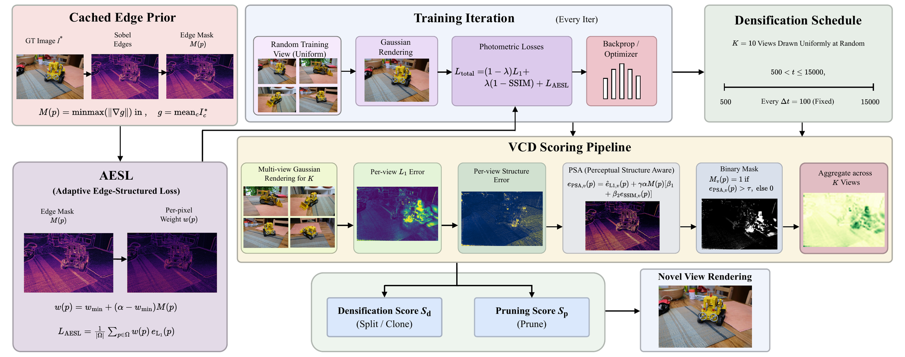

<div align="center">

# FastGS-Adaptive

### Structure-Aware View-Consistent Densification for Accelerated 3D Gaussian Splatting

<p>
<a href="#">

</a>
<a href="#">

</a>
<a href="#">

</a>
<a href="#">

</a>
<a href="https://hanalebeta.github.io/FastGS-Adaptive/">

</a>
<a href="LICENSE">

</a>
</p>

**[Hana L. Goshu](mailto:hana-lebeta.goshu@connect.polyu.hk)<sup>1</sup> &nbsp;&middot;&nbsp;
[Tadesse G. Wakjira](mailto:twakjira@kennesaw.edu)<sup>2</sup> &nbsp;&middot;&nbsp;
[Kin-Man Lam](mailto:kin.man.lam@polyu.edu.hk)<sup>1</sup>**

<sup>1</sup> Department of Electrical and Electronic Engineering, The Hong Kong Polytechnic University, Hong Kong
<sup>2</sup> Department of Civil and Environmental Engineering, Kennesaw State University, Marietta, GA, USA

*Preprint, 2026 (Under Review)*

</div>

---

## Architecture

<div align="center">

<br>
<em>Two additive mechanisms &mdash; an adaptive edge-structured loss (AESL) and perceptual
structure-aware densification (PSA) &mdash; introduce image structure into the photometric
objective and the densification scoring rule, both driven by a single edge prior cached once
per camera.</em>
</div>

## Results

Mip-NeRF 360, nine-scene means. Baselines as reported in the corresponding publications.

| Method | PSNR &uarr; | SSIM &uarr; | LPIPS &darr; | \|G\| |
|---|---|---|---|---|
| 3DGS | 27.53 | .812 | .221 | 2.63 M |
| Mini-Splatting | 27.32 | .821 | .217 | 0.53 M |
| Speedy-Splat | 26.91 | .781 | .295 | 0.30 M |
| Taming-3DGS | 27.48 | .794 | .261 | 0.68 M |
| DashGaussian | 27.73 | .817 | .218 | 2.40 M |
| FastGS | 27.56 | .797 | .261 | 0.40 M |
| FastGS-Big | 27.93 | .820 | .216 | 1.15 M |
| **FastGS-Adaptive** | **28.09** | **.823** | **.211** | 1.58 M |

Deep Blending **30.31** / **.912** / .244 &nbsp;&middot;&nbsp;
Tanks &amp; Temples **24.49** / **.855** / .180. Eight of nine Mip-NeRF 360 scenes improve.

## Setup

```bash
conda env create -f environment.yml && conda activate fastgs
```

Install the three upstream CUDA submodules into the same environment:

```bash
git clone --recursive https://github.com/fastgs/FastGS.git fastgs_upstream
pip install ./fastgs_upstream/submodules/diff-gaussian-rasterization_fastgs
pip install ./fastgs_upstream/submodules/simple-knn
pip install ./fastgs_upstream/submodules/fused-ssim
```

Place [Mip-NeRF 360](https://jonbarron.info/mipnerf360/) scenes under
`~/data/fastgs/datasets/mipnerf360/`.

## Reproduce

```bash
bash run_adaptive_benchmark.sh          # all nine scenes: train, render, metrics
```

## Repository Layout

```
arguments/           CLI / config dataclasses
gaussian_renderer/   FastGS rasteriser wrapper
lpipsPyTorch/        LPIPS metric
scene/               COLMAP loader, Gaussian model
utils/               loss, cached edge mask, densification scoring
train.py             training entry point
render.py            novel-view rendering
metrics.py           PSNR / SSIM / LPIPS
```

## License

Apache 2.0. Built on [FastGS](https://github.com/fastgs/FastGS).
