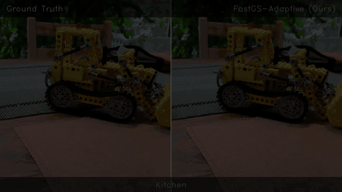
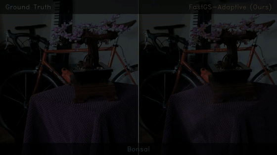
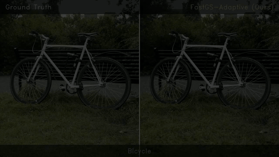

<div align="center">

# FastGS-Adaptive

### Structure-Aware View-Consistent Densification for Accelerated 3D Gaussian Splatting

<p>
<a href="#">

</a>
<a href="#">

</a>
<a href="#">

</a>
<a href="#">

</a>
<a href="LICENSE">

</a>
</p>

**[Hana L. Goshu](mailto:hana-lebeta.goshu@connect.polyu.hk)<sup>1</sup> &nbsp;&middot;&nbsp;
[Tadesse G. Wakjira](mailto:twakjira@kennesaw.edu)<sup>2</sup> &nbsp;&middot;&nbsp;
[Kin-Man Lam](mailto:kin.man.lam@polyu.edu.hk)<sup>1</sup>**

<sup>1</sup> Department of Electrical and Electronic Engineering, The Hong Kong Polytechnic University, Hong Kong
<sup>2</sup> Department of Civil and Environmental Engineering, Kennesaw State University, Marietta, GA, USA

*Preprint, 2026 (Under Review)*

</div>

---

## Architecture

<div align="center">

<br>
<em>FastGS-Adaptive. Two mechanisms, an adaptive edge-structured loss (AESL) and perceptual structure-aware densification (PSA), introduce image structure into the photometric objective and the densification scoring rule respectively, both driven by a single edge prior cached once per camera.</em>
</div>

---

<div align="center">

<br>
<em>Ground Truth (left) vs FastGS-Adaptive (Ours, right) on the <b>kitchen</b> scene.</em>
</div>

<div align="center">

<br>
<em>Ground Truth (left) vs FastGS-Adaptive (Ours, right) on the <b>bonsai</b> scene.</em>
</div>

<div align="center">

<br>
<em>Ground Truth (left) vs FastGS-Adaptive (Ours, right) on the <b>bicycle</b> outdoor scene.</em>
</div>

---

## Abstract

3D Gaussian Splatting (3DGS) is the dominant representation for real-time novel view synthesis,
and recent frameworks such as FastGS have cut per-scene training from tens of minutes to a few
through multi-view consistent densification and pruning. In the fastest of these, primitives are
selected for subdivision by counting photometric residuals above a fixed threshold within their
footprints. Neither that criterion nor the objective producing the residuals accounts for image
structure, so a residual on a thin geometric edge is treated like one on a flat surface: primitives
are added where they yield little benefit while fine structure stays under-represented.

We propose **FastGS-Adaptive**, a structure-aware densification framework built on two
complementary mechanisms, both driven by a single edge prior computed once per camera from the
ground truth and cached.

- **AESL** (Adaptive Edge-Structured Loss) modulates the per-pixel photometric penalty by that
  prior, concentrating optimisation pressure on structurally informative regions.
- **PSA** (Perceptual Structure-Aware densification) replaces the thresholded photometric residual
  in the scoring rule with an edge-gated combination of photometric and local structural-similarity
  error, directing subdivision toward primitives carrying structural error rather than those
  covering smooth surfaces.

Neither modifies the CUDA rasteriser, the primitive parameterisation, or the rendering pipeline.
On Mip-NeRF 360 the method attains **28.12 dB PSNR, 0.825 SSIM and 0.205 LPIPS** against 27.93 dB,
0.820 and 0.216 for the strongest baseline configuration, improving on 8 of the 9 scenes, with
gains carrying over to Deep Blending and Tanks & Temples.

## Results

Mip-NeRF 360, nine-scene means. Baseline figures are those reported in the corresponding
publications.

| Method | PSNR &uarr; | SSIM &uarr; | LPIPS &darr; | Primitives |
|---|---|---|---|---|
| 3DGS | 27.53 | .812 | .221 | 2.63 M |
| Mini-Splatting | 27.32 | .821 | .217 | 0.53 M |
| Speedy-Splat | 26.91 | .781 | .295 | 0.30 M |
| Taming-3DGS | 27.48 | .794 | .261 | 0.68 M |
| DashGaussian | 27.73 | .817 | .218 | 2.40 M |
| FastGS | 27.56 | .797 | .261 | 0.40 M |
| FastGS-Big | 27.93 | .820 | .216 | 1.15 M |
| **FastGS-Adaptive (ours)** | **28.12** | **.825** | **.205** | 1.93 M |

Training cost is 1.29x FastGS-Big, which remains below every other method compared.

## Setup

Create the conda environment from `environment.yml`:

```bash
conda env create -f environment.yml
conda activate fastgs
```

The training pipeline depends on three CUDA submodules from the upstream
FastGS project (`diff-gaussian-rasterization_fastgs`, `simple-knn`, and
`fused-ssim`). Clone the upstream repository and install them in editable
mode into the same environment:

```bash
git clone --recursive https://github.com/fastgs/FastGS.git fastgs_upstream
cd fastgs_upstream
pip install ./submodules/diff-gaussian-rasterization_fastgs
pip install ./submodules/simple-knn
pip install ./submodules/fused-ssim
cd ..
```

Download the [Mip-NeRF 360 dataset](https://jonbarron.info/mipnerf360/) and
place each scene under `~/data/fastgs/datasets/mipnerf360/`.

## Reproduce

Run all nine scenes end-to-end (training, rendering, metrics):

```bash
bash run_adaptive_benchmark.sh
```

Or train a single scene manually:

```bash
python train.py -s ~/data/fastgs/datasets/mipnerf360/kitchen \
                --eval --densification_interval 500 \
                --adaptive_densification --structural_weight 5.0 \
                --densify_until_iter 18000 \
                --highfeature_lr 0.02 --grad_abs_thresh 0.0002 \
                --model_path output/kitchen_Adaptive
python render.py  -m output/kitchen_Adaptive --skip_train --quiet
python metrics.py -m output/kitchen_Adaptive
```

## Repository Layout

```
arguments/           CLI / config dataclasses
gaussian_renderer/   FastGS rasteriser wrapper + network GUI
lpipsPyTorch/        LPIPS metric (perceptual similarity)
scene/               COLMAP loader, dataset readers, Gaussian model
utils/               loss, cached edge mask, PSA densification scoring
train.py             training entry point (FastGS-Adaptive)
render.py            per-scene novel-view rendering
metrics.py           PSNR / SSIM / LPIPS evaluation
compare_final.py     aggregate metrics across scenes
run_adaptive_benchmark.sh   reproduce all nine Mip-NeRF 360 scenes
environment.yml      conda environment specification
```

## License

This project is released under the [Apache 2.0 License](LICENSE).
